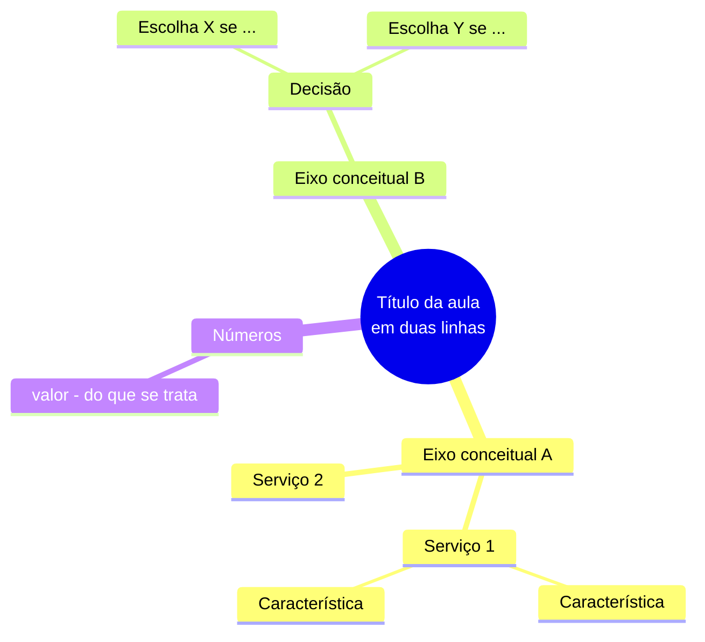

# Mapa mental — <título da aula>

**Domínio:** <d1..d4> · **Processado em:** <AAAA-MM-DD>

## Mapa da aula

## Como ler este mapa
<Duas ou três frases: qual é o eixo de organização escolhido e por quê. Um mapa sem
legenda de leitura envelhece mal.>

---

## Regras de sintaxe (não apagar)

- `root((texto))` — parênteses duplos só no nó raiz.
- Hierarquia por **indentação**, 2 espaços por nível.
- Proibido dentro do texto de um nó: `(`, `)`, `:` — quebram o parser.
- Quebra de linha dentro do nó: ` `.
- Validar em <https://mermaid.live> ou no preview do VS Code antes de fechar a aula.

## Ao terminar

Atualizar também `estudo/<dominio>/_mapa-dominio.md`, encaixando os ramos desta aula no
mapa acumulado do domínio.
