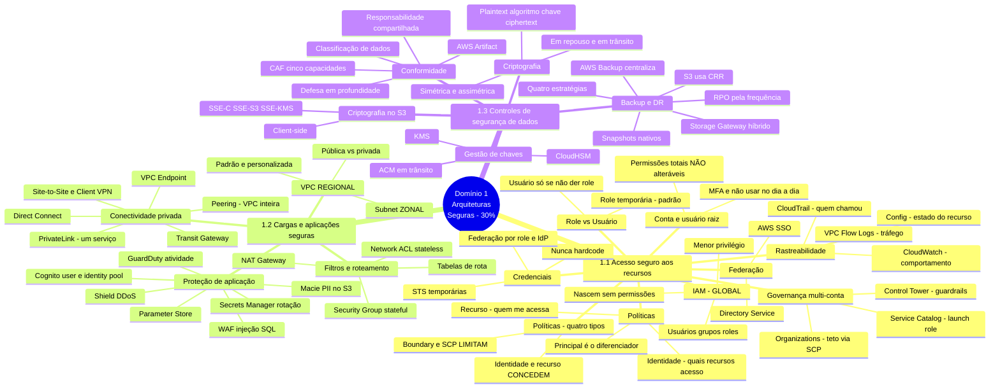

> Mapa vivo. Cada aula processada acrescenta ramos aqui. Este é o diagrama para revisar
> na véspera — o mapa individual de cada aula fica em `<slug>/04-mapa-mental.md`.

## Aulas incorporadas

| Aula | Data | Ramos que acrescentou |
|---|---|---|
| [Domain 1 Review](d1-review/01-resumo.md) | 2026-07-19 | Estrutura completa das três declarações de tarefa — todos os ramos acima |
| ↳ módulo 5 corrigido | 2026-07-19 | Tipos de política, role vs. usuário, Service Catalog, Directory Service e os serviços de monitoramento |

## Lacunas do domínio
- **A aula não traz nenhum valor quantitativo** — define escopo, não detalhe. Os números foram levantados na documentação e incorporados a `d1-review/02-conteudo.md`: durações do STS (12 h / 36 h), banda de VPN (1,25 Gbps por túnel) e Direct Connect (1/10/100 Gbps), preço do Shield Advanced (US$ 3.000/mês), rotação do KMS (365 dias, faixa 90–2560), renovação do ACM (60 dias antes).
- **Resolvidos pela documentação:** lógica de avaliação de políticas do IAM · simétrica vs. assimétrica · rotação por tipo de chave · renovação no ACM · Shield Standard vs. Advanced · NACL da VPC padrão vs. personalizada · KMS vs. CloudHSM.
- **Ainda em aberto:** RTO por estratégia de DR · impacto quantitativo da criptografia em desempenho.
