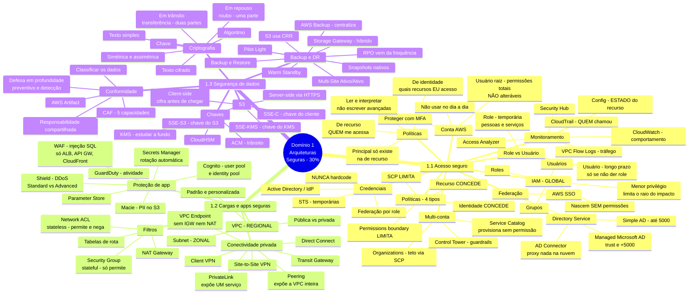

## Mapa da aula

## Como ler este mapa

O eixo de organização é a **estrutura oficial do guia do exame** — as três declarações de
tarefa —, e não os serviços. Isso é deliberado: a AWS escreve as questões a partir das task
statements, então o mapa espelha como você será testado. Um mapa organizado por serviço
ficaria mais bonito e menos útil.

O terceiro nível guarda o **discriminador**, não a definição. `PrivateLink → expõe UM
serviço` contra `Peering → expõe a VPC inteira` é o que resolve a questão; "PrivateLink é um
serviço de conectividade" não resolve nada.

## Ao terminar

Atualizado em `_estudo/d1/00-mapa-dominio.md`.
