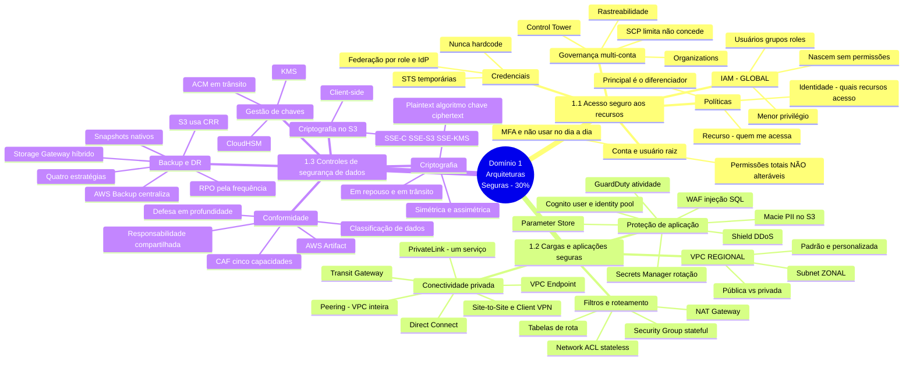

# Mapa acumulado — Criação de arquiteturas seguras

**Domínio 1 do SAA-C03** · Peso no exame: 30%

> Mapa vivo. Cada aula processada acrescenta ramos aqui. Este é o diagrama para revisar
> na véspera — o mapa individual de cada aula fica em `<slug>/04-mapa-mental.md`.

## Aulas incorporadas
| Aula | Data | Ramos que acrescentou |
|---|---|---|
| [Domain 1 Review](d1-review/01-resumo.md) | 2026-07-19 | Estrutura completa das três declarações de tarefa — todos os ramos acima |

## Lacunas do domínio
- **Módulo 5 do Domain 1 Review ("Encerramento") tem transcrição trocada** — texto em inglês sobre processo criativo. Recuperar no Skill Builder.
- **Serviços de rastreabilidade não nomeados** na revisão: CloudTrail, AWS Config, CloudWatch. Cobrados conceitualmente, ausentes do texto.
- **Organizations vs. Control Tower vs. SCP** — citados sem diferenciação.
- **Nenhum valor quantitativo** em toda a aula (capacidade de Direct Connect vs. VPN, duração de tokens STS, RPO/RTO por estratégia de DR, impacto de criptografia em desempenho). A revisão define escopo, não detalhe — os números virão do Domain 1 Practice e da documentação.
- **Pendentes de estudo dirigido:** lógica de avaliação de políticas do IAM · simétrica vs. assimétrica · tipos de chave do KMS e frequência de rotação · renovação de certificados no ACM · Shield Standard vs. Advanced · configuração inicial de segurança da VPC padrão vs. personalizada.
