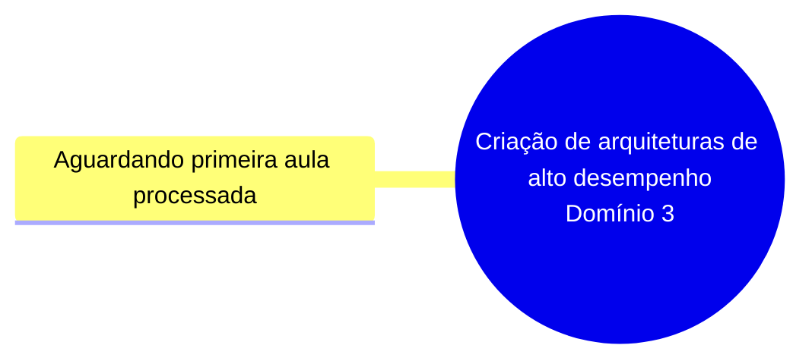

# Mapa acumulado — Criação de arquiteturas de alto desempenho

**Domínio 3 do SAA-C03** · Peso no exame: 24%

> Mapa vivo. Cada aula processada acrescenta ramos aqui. Este é o diagrama para revisar
> na véspera — o mapa individual de cada aula fica em `<slug>/04-mapa-mental.md`.

## Aulas incorporadas
| Aula | Data | Ramos que acrescentou |
|---|---|---|

## Lacunas do domínio
> Tópicos do guia oficial do exame ainda não cobertos por nenhuma aula processada.
